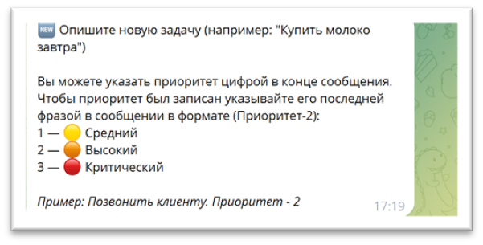
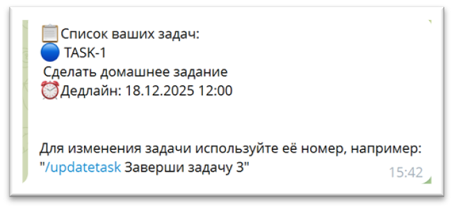
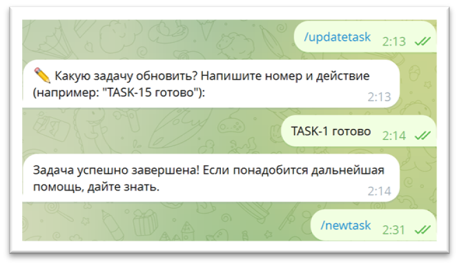
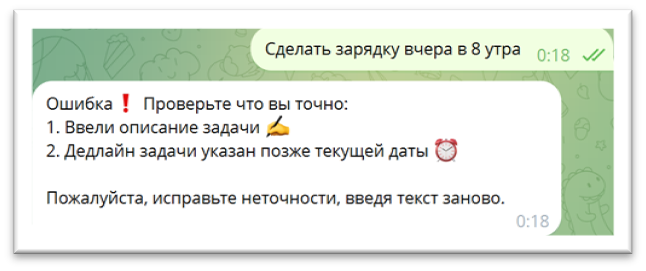
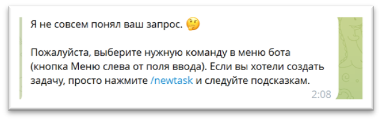
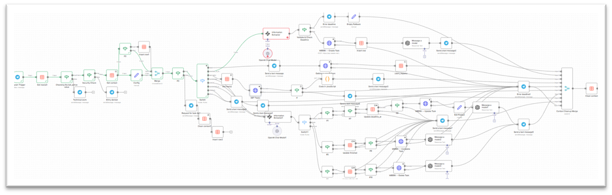

# 🚀 WEEEK AI-Manager: интеллектуальная экосистема управления задачами

**Автоматизированный мост между вашими мыснями в Telegram и рабочим пространством в CRM WEEEK.**

В современном бизнесе до 30% времени уходит на ручной перенос задач из чатов в таск-менеджеры. **WEEEK AI-Manager** полностью устраняет этот барьер. Это высокотехнологичная связка на базе **n8n** и **искусственного интеллекта**, которая превращает мессенджер в полноценный пульт управления бизнесом. Система не просто пересылает текст: она анализирует намерения, извлекает суть и мгновенно синхронизирует ваши мысли с экосистемой WEEEK, позволяя тратить время на принятие решений, а не на рутину.

---

## 💼 Коммерческая ценность для бизнеса

* **Экономия времени (ROI):** постановка задачи занимает 3-5 секунд вместо 2-3 минут. Для команды из 10 человек это высвобождает до 40 часов чистого рабочего времени в месяц.
* **Ликвидация «забытых задач»:** ИИ-агент фиксирует поручения в момент их обсуждения в чате. Больше ничего не теряется в переписках.
* **Безупречная чистота данных:** встроенный AI-валидатор проверяет логику дедлайнов и корректность данных, исключая «мусор» и ошибки в вашем WEEEK.
* **Масштабируемость:** благодаря гибкой архитектуре n8n, система легко адаптируется под любые уникальные процессы вашей компании.

---

## 📸 Функциональные возможности (Product Demo)

### ⚡ Оперативное управление
| Создание задачи | Список активных дел | Обновление статусов |
| :---: | :---: | :---: |
|  |  |  |

### 🛡 Интеллектуальная защита процессов
Система минимизирует человеческий фактор, обеспечивая корректность каждой записи:

* **Валидация сроков:** ИИ не позволит установить дедлайн в прошлом или в некорректном формате.
    
* **Контроль соответствия:** система проверяет наличие задач и корректность ID перед внесением правок.
    
* **Фильтрация шума:** агент игнорирует сообщения, не несущие ценности для бизнеса, сохраняя фокус системы.
    

---

## 🏗 Технический стек и надежность
Проект реализован как отказоустойчивый workflow на платформе **n8n**, использующий современные методы обработки естественного языка.
В основе решения лежит мощная архитектура, обеспечивающая стабильность и гибкость:
* **n8n (Workflow Automation):** «Сердце» системы, координирующее обмен данными между сервисами.
* **WEEEK API:** Прямая интеграция с таск-менеджером для мгновенного манипулирования задачами и CRM.
* **AI Agent (LLM Integration):** Нейросетевой модуль для интерпретации человеческого языка и принятия логических решений.
* **Telegram Bot API:** Удобный и быстрый интерфейс для взаимодействия с пользователем.

**Визуализация архитектуры:**

---

## 🛠 Быстрое развертывание
1. Импортируйте файл конфигурации `ai-task-manager-weeek-automation.json` в ваш n8n.
2. Подключите API-ключи Telegram и WEEEK в соответствующих узлах.
3. Запустите ассистента и выведите продуктивность команды на новый уровень.

---
## Лицензия

MIT License

---

## 📞 Контакты

Если вам нужно внедрить подобное решение или автоматизировать бизнес-процессы с помощью AI:
* **Telegram:** [@Margo_AI_Engineer](https://t.me/Margo_AI_Engineer)
* **GitHub:** [zuzinamd-creator](https://github.com/zuzinamd-creator)
